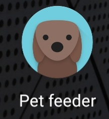
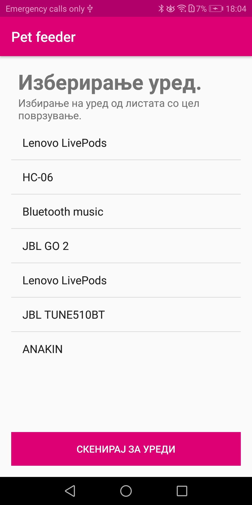
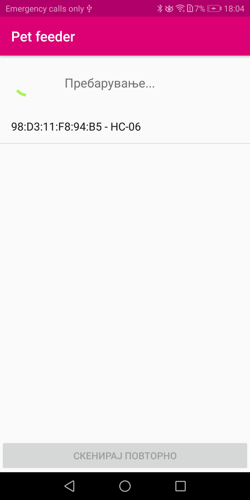
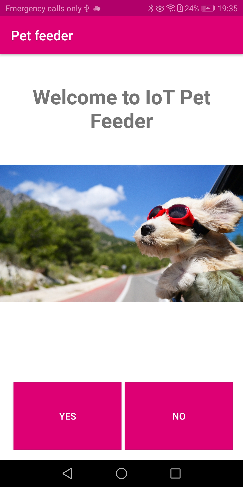
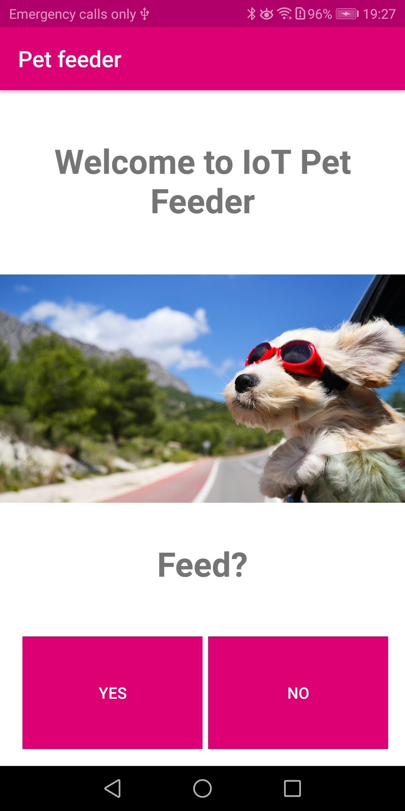
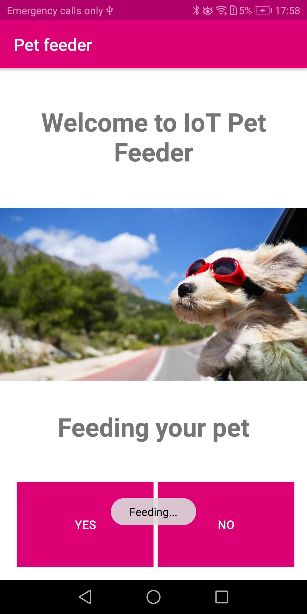
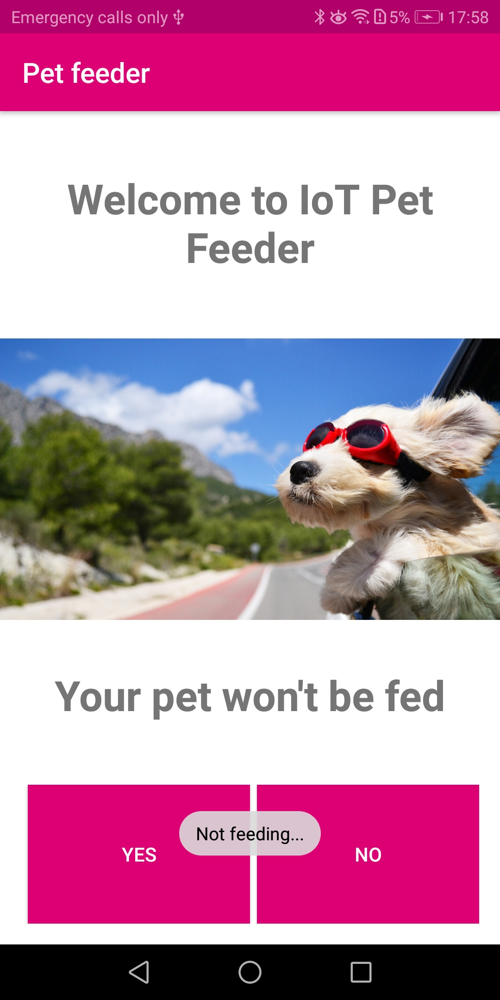

### Краток опис на апликацијата

- Прво како изгледа почетната икона:
  
  

- Кога ќе ја отвориме, првично доаѓаме до следниот екран. На него избираме од уредите кои што Bluetooth скенирањето веќе ги има најдено:
  
  

- Доколку ни треба нов уред, има посебен екран преку кој истиот може да се поврзе (копчето "СКЕНИРАЈ ЗА УРЕДИ"):
  
  

- Кога ќе го избереме уредот со кој сакаме да се поврземе, кликнуваме на истиот. Успешно поврзување не носи на следниот екран, кој е и главен во самата апликација:
  
  

- Сигнал од Arduino уредот дека е забележано движење поставува прашање дали сакаме да го нахраниме миленикот:
  
  

- Доколку избереме дека сакаме, му враќа одговор на уредот соодветен за вртење на моторот и со тоа хранење на миленикот:
  
  

- Доколку избереме дека не сакаме, му враќа одговор на уредот соодветен за непреземање на никаква акција:
  
  
